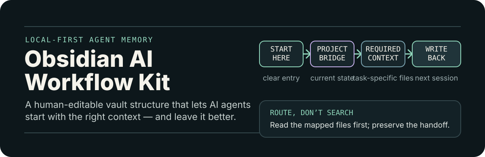
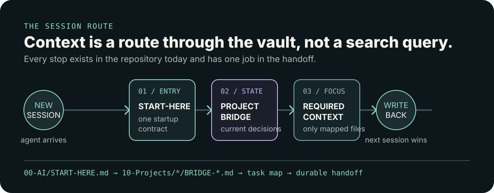
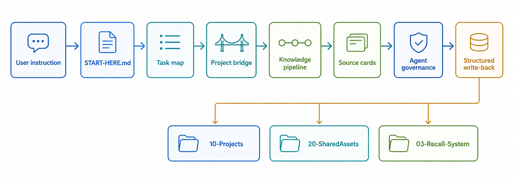

# Obsidian AI Workflow Kit

<p align="center">
  
</p>

[Chinese](README.zh-CN.md) | English

[](https://github.com/Moxi-Lab/obsidian-ai-workflow-kit/actions/workflows/ci.yml)

Make your local Obsidian vault readable, writable, and maintainable by AI agents.

## Give every new AI session a reliable starting point

Claude Code, Cursor, Codex, and ChatGPT should not need to rediscover what a project is, where its decisions live, or what changed last time. This kit provides a local-first Obsidian structure with one startup entry, project bridge cards, write-back rules, source triage, recall maps, and maintenance checks.

It is a file-system-level workflow, not an app, community plugin, cloud memory service, or RAG stack. Humans can edit every part; any AI agent with file access can follow it. Instead of searching the entire vault, the agent routes to the small set of files the current task needs. Optional dashboards use Obsidian's built-in Bases core plugin.

<p align="center">
  
</p>

## Start fast

### New or existing vault

Recommended first step: install the minimal layer into your own vault.

The installer writes English paths and starter text by default. Use `--language zh-CN` for Chinese paths and starter text.

Preview:

```bash
curl -fsSL https://raw.githubusercontent.com/Moxi-Lab/obsidian-ai-workflow-kit/main/install.sh | bash -s -- --dry-run "/path/to/your-vault"
```

Install:

```bash
curl -fsSL https://raw.githubusercontent.com/Moxi-Lab/obsidian-ai-workflow-kit/main/install.sh | bash -s -- "/path/to/your-vault"
```

Chinese paths and starter text:

```bash
curl -fsSL https://raw.githubusercontent.com/Moxi-Lab/obsidian-ai-workflow-kit/main/install.sh | bash -s -- --language zh-CN "/path/to/your-vault"
```

Check:

```bash
python3 "/path/to/your-vault/00-AI/scripts/kb.py" health-check --vault "/path/to/your-vault" --mode barebone
```

For Chinese install paths, see [README.zh-CN.md](README.zh-CN.md).

Then send this to your AI agent:

```text
You are the knowledge base maintenance agent. The root directory of this Obsidian vault is: <your-vault-path>. First read 00-AI/START-HERE.md in that directory, then follow its startup workflow.
```

Use full mode when you want the complete starter vault, including pipeline, recall system, docs, examples, and templates:

```bash
curl -fsSL https://raw.githubusercontent.com/Moxi-Lab/obsidian-ai-workflow-kit/main/install.sh | bash -s -- --mode full "/path/to/your-vault"
```

The installer skips existing files by default. Pass `--overwrite` only when you intentionally want to replace files.

Update later:

```bash
curl -fsSL https://raw.githubusercontent.com/Moxi-Lab/obsidian-ai-workflow-kit/main/install.sh | bash -s -- --update --dry-run "/path/to/your-vault"
curl -fsSL https://raw.githubusercontent.com/Moxi-Lab/obsidian-ai-workflow-kit/main/install.sh | bash -s -- --update "/path/to/your-vault"
```

Updates use a local manifest to replace only managed kit files that you have not edited.

The downloadable `v0.9.1` archives remain historical snapshots. Starting with `v0.10.0`, ongoing maintenance uses repository source plus the managed installer, and the project no longer builds custom customer ZIP packages.

### Keep an established working vault in sync

Use `shared-core` when the vault already has its own entry, projects, Inbox, archives, and private context. This mode manages only reusable system files and excludes working content.

From a local clone of this repository, preview and then apply:

```bash
python3 00-AI/scripts/kb.py upgrade-core "/path/to/working-vault" --mode shared-core --language zh-CN --dry-run
python3 00-AI/scripts/kb.py upgrade-core "/path/to/working-vault" --mode shared-core --language zh-CN
```

The target vault must explicitly allow only `shared-core` in `.obsidian-ai-workflow-kit/adoption-policy.json`. See [Source Sync Policy](docs/release/source-sync-policy.md).

### See the handoff in 30 seconds

Try the read-only demo before installing anything:

1. Download or clone this repository.
2. In Obsidian, choose **Open folder as vault** and select the repository folder. A vault is just a local Markdown folder.
3. Send the prompt in [30-Second Demo](docs/30-second-demo.md).

The demo shows an AI agent reading the startup entry, finding a filled project bridge card, and reporting current state, latest decision, and next action. No Obsidian community plugins are required.

## What gets installed

| Need | Included layer |
|---|---|
| AI needs a clear start point | `00-AI/START-HERE.md` |
| Project context is scattered | project bridge cards in `10-Projects/` |
| AI writes too freely | governance rules in `00-AI/governance/` |
| Local materials need sorting | knowledge pipeline in `00-AI/pipeline/` |
| Useful lessons are hard to recall | task maps and recall fields in `00-AI/recall/` |
| Handwritten indexes go stale | optional project, task, and source Bases in `00-AI/bases/` |
| Metadata silently drops pages from views | typed status, `project_entry`, and Base-field health checks |
| The vault slowly gets messy | read-only link, metadata, and maintenance checks |

The minimal layer is deliberately small: it gives an agent a reliable entry, a project-aware route, and clear write-back rules. Add the pipeline, recall system, dashboards, examples, and templates only when the vault needs them.

## How the routing works



Daily use stays small:

```text
User task
  -> 00-AI/START-HERE.md
  -> relevant project bridge card or task map
  -> execute directly when the current conversation can finish
  -> create 01-Inbox/tasks/ card only for queued, cross-session, or blocked work
  -> required context only
  -> structured write-back
  -> reusable lessons promoted for future recall
```

The agent should not scan your whole vault by default. It should read the startup entry, open the mapped context, do the task, and write results back to the right place. When specialist review is useful, name the perspective in the task or acceptance criteria.

## Choose an install scope

The default install is the minimal starter template. Advanced users can pass `--mode full` or the restricted `--mode shared-core` profile.

| Mode | Best for | What it installs |
|---|---|---|
| `barebone` | First step inside an existing vault | startup entry, core workflow folders, governance, project registry, templates, `00-AI/scripts/kb.py` |
| `full` | New complete starter vault | all workflow folders, examples, docs, templates, scripts, and built-in Bases views |
| `shared-core` | Keep an established working vault aligned | reusable rules, pipeline, recall, templates, Bases, scripts, and standards; no entry, projects, Inbox, archives, or root files |

Security-sensitive users can skip the remote `curl` form and run the installer from a local clone:

```bash
bash install.sh --dry-run "/path/to/your-vault"
bash install.sh "/path/to/your-vault"
bash install.sh --language zh-CN "/path/to/your-vault"
```

## Is this for you?

Good fit:

- You already use Obsidian for project notes, sources, or decisions.
- You use AI agents often enough that context handoff is painful.
- You want local-first memory that remains human editable.
- You are willing to keep project state and handoffs current.

Not a good fit:

- You want a graphical Obsidian plugin.
- You want a cloud memory service or managed RAG backend.
- You want AI to scan your whole computer automatically.
- You want automatic bulk rewriting of an existing vault.

## Learn more

- [30-Second Demo](docs/30-second-demo.md)
- [10-Minute First Run](docs/10-minute-first-run.md)
- [Before / After Case](docs/before-after-case.md)
- [Automation Starter](docs/automation.md)
- [Migration Guide](docs/migration.md)
- [Concepts](docs/concepts.md)
- [Templates](docs/templates.md)
- [Scripts](00-AI/scripts/README.md)
- [v0.9.1 Release Notes](docs/release/v0.9.1-release-notes.md)

## Repository layout

```text
00-AI/START-HERE.md              AI startup entry
00-AI/governance/       write-back, review, and maintenance rules
00-AI/pipeline/     local material intake and promotion
00-AI/recall/          task-to-context maps and recall fields
00-AI/bases/           optional built-in Bases dashboards (full mode)
01-Inbox/tasks/        queued, cross-session, or blocked local tasks
10-Projects/               project workspaces and bridge cards
20-SharedAssets/           reusable methods and lessons
40-ExternalSources/        source analysis cards
00-AI/templates/              reusable note templates
docs/                      guides, diagrams, and walkthroughs
00-AI/scripts/                   optional helper scripts
examples/                  demo project and source workflows
```

English installs use English paths. Chinese installs localize the core vault paths; see [README.zh-CN.md](README.zh-CN.md) for the exact path names.

## Maturity

This is a `0.x` beta starter kit. It is ready for controlled trials, small vaults, and feedback. It does not promise compatibility with every existing Obsidian vault layout.

This is a workflow kit, not an automation platform. If project state, decisions, handoffs, and reusable lessons are not maintained, the vault will slowly become ordinary folders again.

## License

- Code, scripts, and executable snippets: [MIT](LICENSE).
- Original written content, templates, examples, and documentation: [CC BY 4.0](docs/legal/content-license.md).
- Third-party content is not covered by this repository license.

## Version

Current version: `0.11.0`. See [CHANGELOG.md](CHANGELOG.md).
