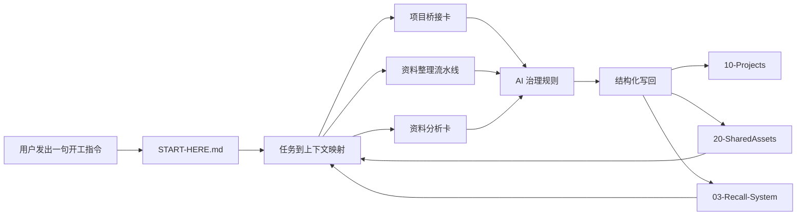

# Obsidian AI Memory Kit

中文 | [English](README.md)

让每个新的 AI 对话窗口，都能快速接上你的项目上下文。

你打开一个新的 Claude Code、Cursor、Codex 或 ChatGPT 会话。它又问你：这个项目是什么？关键资料在哪？上次做到哪？哪些内容不能乱改？

Obsidian AI Memory Kit 解决的就是这个接手问题：在本地 Obsidian vault 上加一层 AI 能执行的操作约定，包括唯一开工入口、写回规则、任务到上下文的映射、资料分流、审查门和经验升舱机制。

它不是 App、插件、云端记忆服务，也不是 RAG 系统。它是一套文件系统层的约定：人能直接读写，任何能读取本地文件的 AI Agent 都能执行。

它能帮你：

- 不再每次换 AI 对话窗口都重复解释项目背景。
- 把本地文件、网页剪藏、笔记、聊天结论分流成正确的知识类型。
- 让 AI 知道哪些能写、写到哪里、写入前要验证什么。
- 让项目状态、决策、资料摘要、经验资产能被后续任务召回。
- 用巡检、审查门和写回规则持续维护知识库。
- 在自己的本地 Obsidian vault 里使用，不依赖云端服务。

## 它解决什么问题

AI Agent 越常用，“换窗口就失忆”的问题越明显。现有方案大多绑在某个工具里，要么需要额外基础设施，要么只是全文检索，人和 AI 都很难共同维护。

这个仓库做的事，是在 Obsidian 这个本地知识文件系统上，加一层 AI 可读、可执行、可维护的操作约定。

| 方案 | 本质 | 缺陷 |
|---|---|---|
| Claude Code memory files | 工具内置记忆 | 绑定单一工具和工作流 |
| Cursor Rules | 项目级指令 | 更偏代码项目，不覆盖资料、经验和知识库维护 |
| 向量记忆系统 | 嵌入式记忆存储 | 需要基础设施，不透明，不方便人工编辑 |
| 普通 Obsidian / Notion 笔记 | 人类笔记 | AI 不知道入口、优先级和写回规则 |
| RAG 插件 | 全文检索 | 召回容易噪声大，缺少任务映射和优先级 |
| 这个仓库 | AI 可执行的 Obsidian 操作约定 | 本地文件、人类可编辑、工具无关、按任务召回 |

## Quick Start

1. 克隆或下载这个仓库。
2. 在 Obsidian 里选择 **Open folder as vault**，打开这个仓库目录。不需要社区插件。Obsidian 会在你打开目录时自动创建本地 `.obsidian/` 配置。
3. 打开 `START-HERE.md`。
4. 把下面这句话发给你的 AI Agent：

中文：

```text
你是知识库维护 Agent，请阅读当前 vault 的 START-HERE.md，并按里面的开工流程执行。
```

English:

```text
You are the knowledge base maintenance agent. Read START-HERE.md in the current vault and follow its startup workflow.
```

如果你的 AI 不是从 vault 根目录启动，需要把 vault 路径一起发给它：

中文：

```text
你是知识库维护 Agent。这个 Obsidian vault 的根目录是：<your-vault-path>。请先读取该目录下的 START-HERE.md，并按里面的开工流程执行。
```

English:

```text
You are the knowledge base maintenance agent. The root directory of this Obsidian vault is: <your-vault-path>. First read START-HERE.md in that directory, then follow its startup workflow.
```

可以发给能读取本地文件的工具，比如 Claude Code、Cursor、Codex CLI，或者上传/暴露 vault 文件后的 ChatGPT 会话。如果工具不能直接读取本地文件，就使用上面带路径的版本。

如果要整理本机资料，在 AI 读完 `START-HERE.md` 后，再给它一个文件夹路径或文件清单。AI 应该先走资料整理流水线，而不是盲目扫描整个电脑。

## 为什么需要它

大多数笔记是给人看的，但不一定适合 AI 稳定整理、治理、召回和维护。

这套结构是在 Obsidian 上加一层轻量工作规则：

| 问题 | 这套结构提供什么 |
|---|---|
| AI 不知道从哪里开始 | 用 `START-HERE.md` 作为唯一开工入口 |
| 本机资料混在一起 | 用 `02-Knowledge-Pipeline/` 做进入、分类、提炼和升舱 |
| AI 写入太随意 | 用 `00-Agent-Governance/` 管写回、审查和维护 |
| 有用知识难召回 | 用 `03-Recall-System/` 管任务到上下文的映射 |
| 项目上下文散落各处 | 用 `10-Projects/` 里的项目桥接卡串起来 |
| 外部资料容易整篇复制进库 | 用 `40-ExternalSources/` 做资料分析卡 |

## 架构



日常使用时，AI 不需要扫描完整 vault：先读开工入口，再按任务映射读取必要上下文，最后把结果写回项目、共享资产或召回系统。

## 范围边界

这套结构只聚焦四件事：

- 资料流水线：把本地资料整理成结构化笔记。
- AI 治理：约束 AI 读什么、写什么、验证什么、避免什么。
- 召回系统：让 AI 按任务找到该读的上下文。
- 维护循环：让知识库持续保持健康。

它不是 RAG 系统，不是云服务，也不是任务管理器。它是一套本地优先的 Obsidian + AI 工作方法。

## 仓库结构

```text
.
├── START-HERE.md
├── index.md
├── AGENTS.md
├── 00-Agent-Governance/
├── 01-Inbox/
├── 02-Knowledge-Pipeline/
├── 03-Recall-System/
├── 10-Projects/
├── 20-SharedAssets/
├── 40-ExternalSources/
├── 90-Templates/
├── scripts/
└── examples/
```

| 路径 | 作用 |
|---|---|
| [`START-HERE.md`](START-HERE.md) | AI Agent 第一个应该读的文件 |
| [`index.md`](index.md) | 给人看的 vault 首页 |
| [`AGENTS.md`](AGENTS.md) | 给 Codex、Claude Code 等 coding agent 的规则 |
| [`00-Agent-Governance/`](00-Agent-Governance/) | 开工契约、审查门、写回规则、维护循环 |
| [`01-Inbox/`](01-Inbox/) | 临时交接、派工卡、网页剪藏入口 |
| [`02-Knowledge-Pipeline/`](02-Knowledge-Pipeline/) | AI 如何把本机资料整理成结构化知识 |
| [`03-Recall-System/`](03-Recall-System/) | 任务到上下文的召回地图和召回字段 |
| [`10-Projects/`](10-Projects/) | 项目工作区和项目桥接卡 |
| [`20-SharedAssets/`](20-SharedAssets/) | 可复用方法、SOP 和工作流 |
| [`40-ExternalSources/`](40-ExternalSources/) | 外部资料分析卡，不保存第三方全文 |
| [`90-Templates/`](90-Templates/) | 标准模板 |
| [`scripts/`](scripts/) | 创建项目卡和巡检的轻量脚本 |
| [`examples/`](examples/) | 从开工到交接的完整示例 |

## 核心思路

### 1. 唯一入口

`START-HERE.md` 会告诉 AI 当前是什么任务、先读哪些文件、结果应该写回哪里。

### 2. 资料整理流水线

`02-Knowledge-Pipeline/` 告诉 AI 如何进入本机资料、分类、提炼、连接、升舱和维护。

### 3. AI 治理层

`00-Agent-Governance/` 告诉 AI 哪些能写、写入前要验证什么、什么时候应该停止猜测。

### 4. 召回系统

`03-Recall-System/` 把任务类型映射到 AI 应该先读的文件。

### 5. 项目桥接卡

每个重要项目都有一张桥接卡，记录项目路径、当前状态、最近决策、下一步动作和写回规则。

可以从这个示例开始：

```text
10-Projects/01-example-project/CODEX-BRIDGE-example.md
```

### 6. Inbox 只是临时区

`01-Inbox/` 用来接收交接卡、任务卡和网页剪藏，不作为长期保存目录。

### 7. 经验要变成资产

重复出现的经验应该进入 `20-SharedAssets/`，并写清楚触发条件、处理动作和验证方式。

### 8. 默认本地优先

这套结构适合复制到你自己的本地 Obsidian vault 中使用。真实项目状态、个人笔记、交接历史和私有资料都留在你自己的机器上。

## 示例工作流

```text
用户指令
  -> START-HERE.md
  -> 召回地图
  -> 治理规则
  -> 资料流水线或项目桥接卡
  -> 结构化写回
  -> 可复用经验进入召回系统
```

可以查看演示：

```text
examples/ai-handoff-demo/README.md
```

想看更接近真实使用状态的填充示例：

```text
examples/filled-example/
```

想看一条资料如何从原始输入变成可召回知识：

```text
examples/source-to-knowledge/
```

日常使用不需要读完整仓库：初始化之后，大多数 AI 会话只需要读 `START-HERE.md`、一个项目桥接卡，以及该项目的 `current-state.md` / `decisions.md`。

如果你已经有自己的 Obsidian vault，先看 [MIGRATION.md](MIGRATION.md)。不要重建整个 vault，先加一张项目桥接卡。

## 可选脚本

不用脚本也能使用这套结构。如果想更快初始化和检查：

```bash
python3 scripts/kb.py health-check
python3 scripts/kb.py new-project my-project --name "My Project" --root "/path/to/project"
python3 scripts/kb.py intake-source "/path/to/source.md" --title "资料标题" --project my-project
```

`health-check` 会检查核心文件、常见概念残留和 Markdown 链接。`new-project` 会在 `10-Projects/` 下创建最小项目工作区和桥接卡。`intake-source` 会生成一张待 AI 继续提炼的资料分析卡。

## 内置模板

| 模板 | 用途 |
|---|---|
| [`TPL-Codex项目桥接卡.md`](90-Templates/TPL-Codex项目桥接卡.md) | 项目接手和接续 |
| [`TPL-Agent交接卡.md`](90-Templates/TPL-Agent交接卡.md) | 任务结束交接 |
| [`TPL-资料分析卡.md`](90-Templates/TPL-资料分析卡.md) | 外部资料分析 |
| [`TPL-任务状态卡.md`](90-Templates/TPL-任务状态卡.md) | 任务状态跟踪 |
| [`TPL-验收记录.md`](90-Templates/TPL-验收记录.md) | 验收记录 |
| [`TPL-问题知识卡-经验资产卡.md`](90-Templates/TPL-问题知识卡-经验资产卡.md) | 高复用问题和经验资产 |
| [`TPL-WebClip-最简模板.md`](90-Templates/TPL-WebClip-最简模板.md) | Web Clipper 原始剪藏 |

## 不包含什么

这个仓库有意排除了：

- 个人资料、偏好和真实项目状态。
- 第三方文章、X 帖、网页剪藏全文或长篇翻译。
- 交易记录、账户信息或策略运行状态。
- Agent 运行日志和私人交接历史。
- 本机路径、同步脚本、API Key、Token、Cookie、私钥、密码和验证码。

## License

- 原创文字内容：CC BY 4.0。
- 代码、脚本和可执行片段：MIT。
- 第三方内容不包含在本仓库授权范围内。

## Version

当前版本：`0.4.2`。见 [CHANGELOG.md](CHANGELOG.md)。
